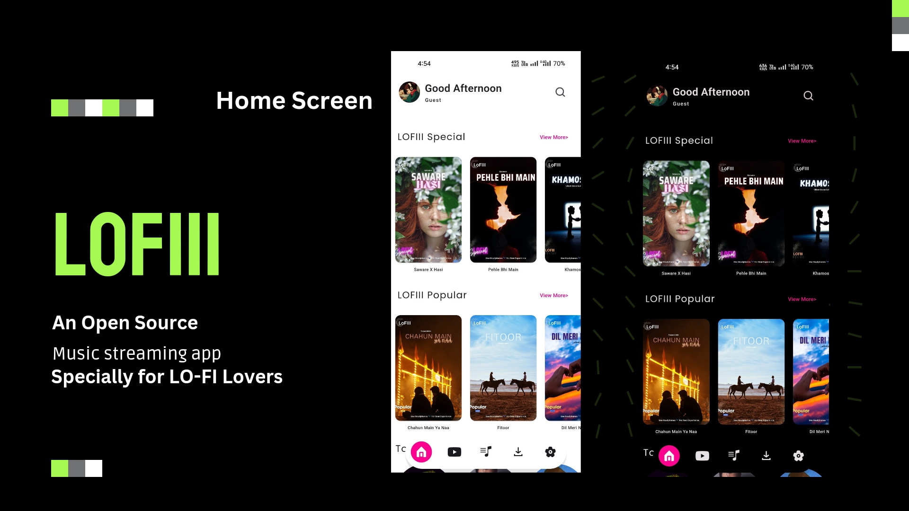
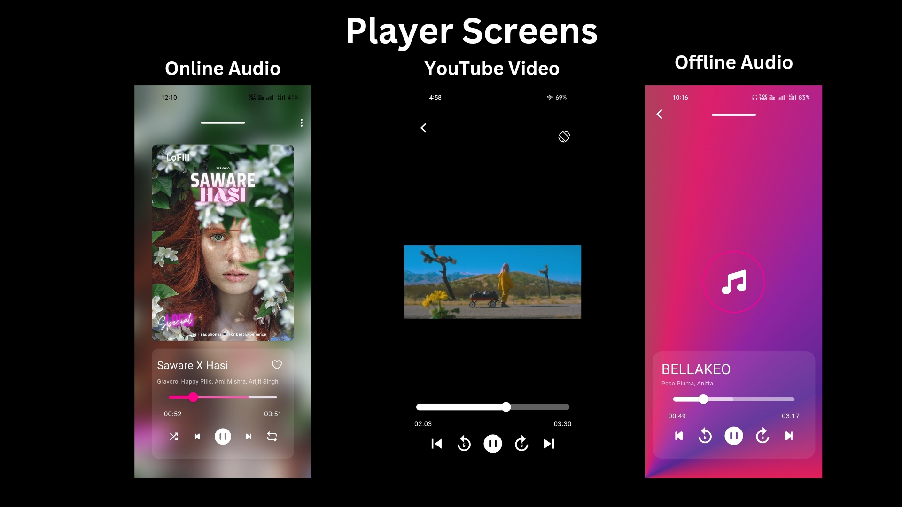
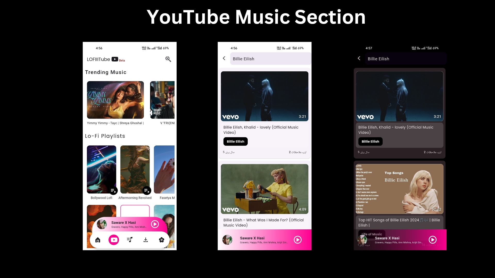
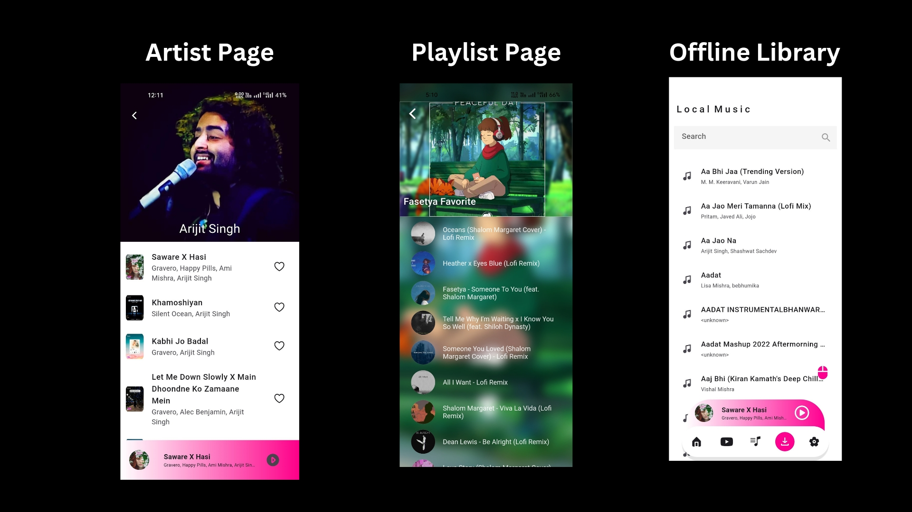
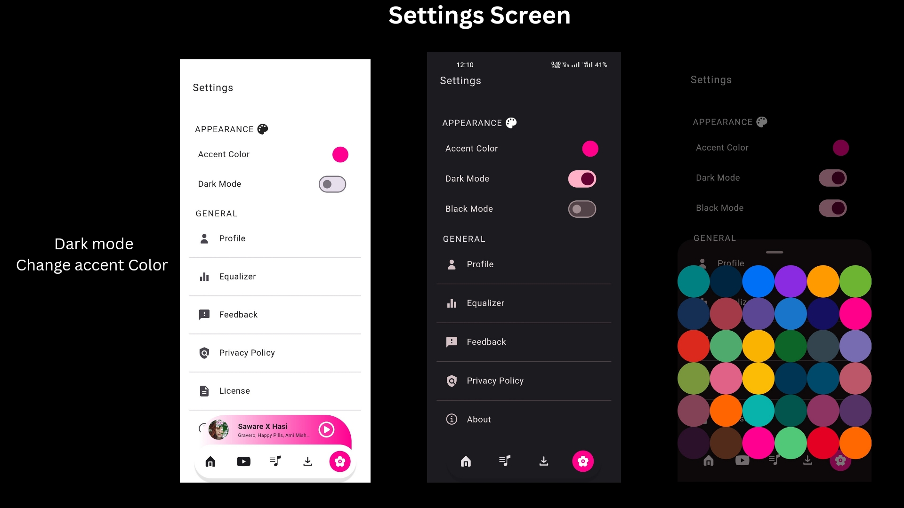

# LOFIII - Flutter Open Source Music Streaming App for Lo-Fi lovers 

LOFIII is a beautiful and intuitive music streaming app built with Flutter. It allows users to discover and listen to their favorite Lo-Fi version of music on the go. With a sleek design and seamless user experience, LOFIII is your ultimate companion for enjoying music effortlessly.

## Features

- **Stream Music:** Enjoy Only Lo-Fi library of songs from various genres and artists.
- **Create Playlists:** Create your playlists and organize your music collection.
- **Search Functionality:** Easily find your favorite tracks, albums, or artists with our search feature.
- **Offline Mode:** Download songs and playlists to listen to them offline, anytime, anywhere.
- **Customizable Interface:** Personalize your listening experience with customizable themes and layout options.
- **Cross-Platform Compatibility:** Available for Android devices, with plans for iOS, Web support in the future.
- **Song, Album, Artist and Playlist Search**
- **Add Songs to Favorite**
- **Lyrics Support**
- **Listening history record**
- **Dark mode / accent color**
- **Custom Gradients and other Theme options**
- **Download for offline play (320kbps)**
- **Play Online as well as Offline Songs**
- **Inbuilt Equalizer**
- **Cache support**
- **No Subscription**
- **No Ads**

## Screenshots

## Installation

To install LOFIII on your Android device, simply download the APK file from the [releases page](link-to-releases) and follow the installation instructions.

# Contributing to this repository

## Getting started

Before you begin:
- This project is powered by Flutter. Make sure you have the latest version of Flutter.
- Have you read the [code of conduct](CODE_OF_CONDUCT.md)?
- Make sure to check if an [issue exists](https://github.com/ffurqanuddin/lofiii/issues) already & see if the issue is assigned to anyone or not.
- If no one is assigned you can start working on the issue.
- Make sure to leave a comment stating that you are working on the issue.

### Issue already assigned to someone? Ask before starting

If the issue is already assigned to someone, leave a comment asking how you can contribute. Please do not start working on your own without confirmation.

### Ready to make a change? Fork the repo

Fork using GitHub Desktop:

- [Getting started with GitHub Desktop](https://docs.github.com/en/desktop/installing-and-configuring-github-desktop/getting-started-with-github-desktop) will guide you through setting up Desktop.
- Once Desktop is set up, you can use it to [fork the repo](https://docs.github.com/en/desktop/contributing-and-collaborating-using-github-desktop/cloning-and-forking-repositories-from-github-desktop)!

Fork using the command line:

- [Fork the repo](https://docs.github.com/en/github/getting-started-with-github/fork-a-repo#fork-an-example-repository) so that you can make your changes without affecting the original project until you're ready to merge them.

Fork with [GitHub Codespaces](https://github.com/features/codespaces):

- [Fork, edit, and preview](https://docs.github.com/en/free-pro-team@latest/github/developing-online-with-codespaces/creating-a-codespace) using [GitHub Codespaces](https://github.com/features/codespaces) without having to install and run the project locally.

### Make your update:
Make your changes to the file(s) you'd like to update.

### Open a pull request
When you're done making changes and you'd like to propose them for review, open your PR (pull request). You can use the GitHub user interface for some small changes, like fixing a typo or updating a readme. You can also fork the repo and then clone it locally, to view changes and run your tests on your machine.

### Submit your PR & get it reviewed
- Once you submit your PR, others from the Docs community will review it with you. The first thing you're going to want to do is a [self review](#self-review).
- After that, we may have questions, check back on your PR to keep up with the conversation.
- We may ask for changes to be made before a PR can be merged. You can make any other changes in your fork, then commit them to your branch.

### Your PR is merged!
Congratulations! 

Once your PR is merged, you will be proudly listed as a contributor in the [contributor chart](https://github.com/ffurqanuddin/lofiii/graphs/contributors).

### Self review
You should always review your own PR first.

For content changes, make sure that you:
- [ ] Confirm the changes doesn't break anything else.
- [ ] Compare your pull request's source changes to staging to confirm that the output matches the source and that everything is rendering as expected. This helps spot issues like typos, content that doesn't follow the style guide, or content that isn't rendering due to versioning problems.
- [ ] Review the content for technical accuracy.
- [ ] Copy-edit the changes for grammar or spelling mistakes.

## Feedback

We'd love to hear your feedback on LOFIII. If you encounter any bugs, have feature requests, or just want to say hi, please [open an issue](link-to-issues) on GitHub.

## Support

For support or any inquiries, feel free to contact us at 
[furqanuddin@programmer.net](mailto:furqanuddin@programmer.net).

**Note:** LOFIII is still under active development, and new features and improvements are being added regularly. Stay tuned for updates! 

Enjoy your music with LOFIII! 🎵✨