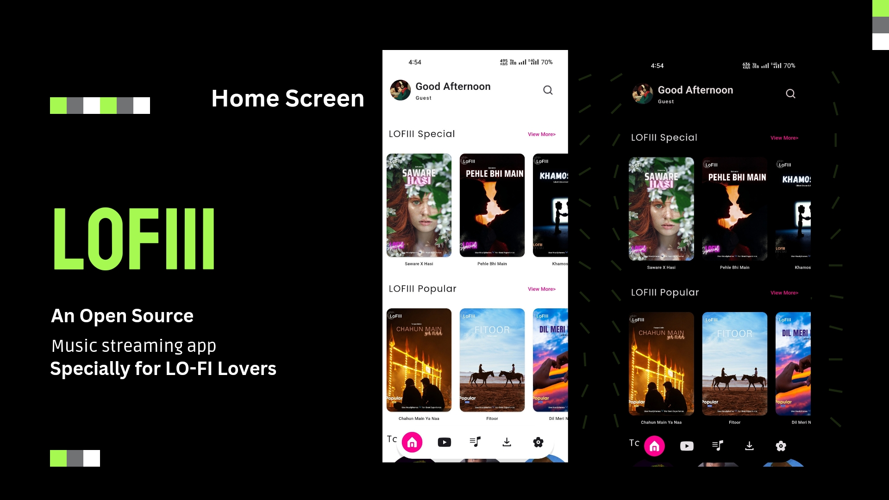
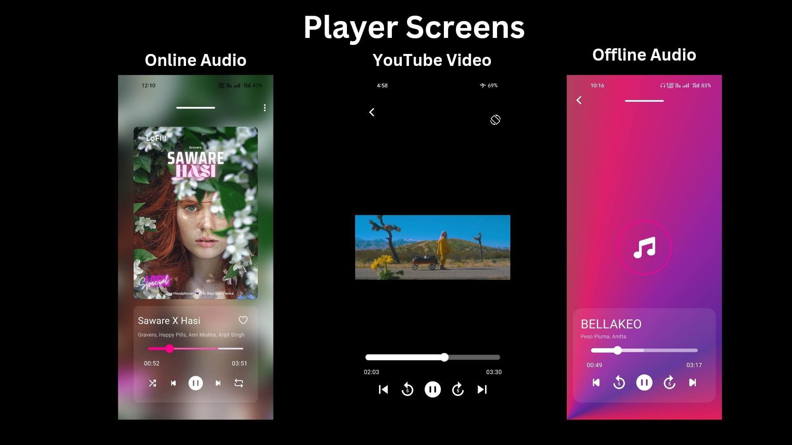
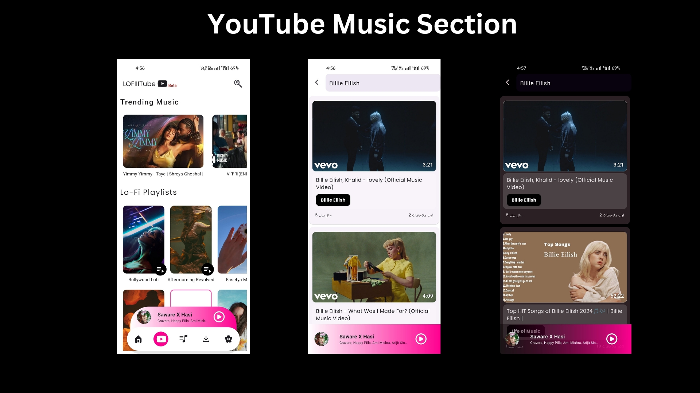
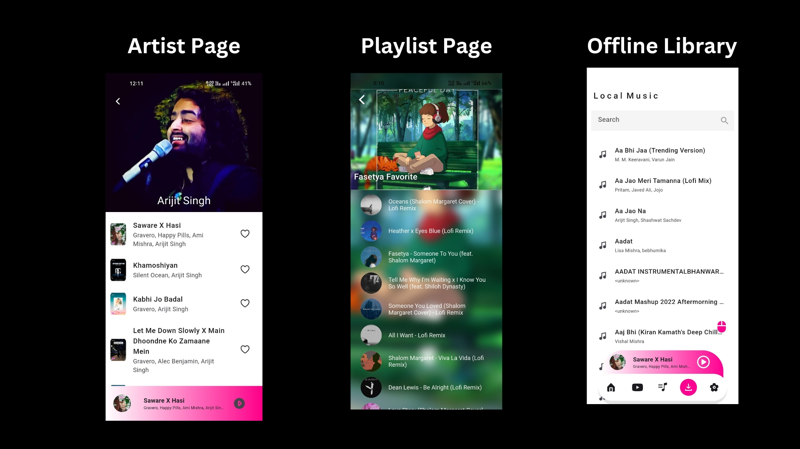
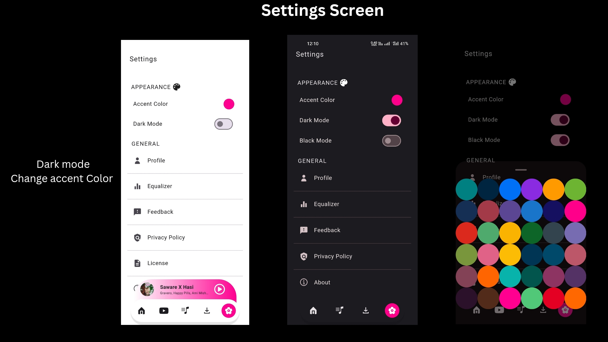

 

# LOFIII

### *Lo-Fi streaming, made beautifully simple.*

A free, open-source Lo-Fi music streaming app built with Flutter. No ads. No subscriptions. Just good music.

 

 

---

 

## ✦ What is LOFIII?

LOFIII brings your Lo-Fi music experience into one clean, distraction-free app. Stream or download your favorite tracks, build playlists, and tune the sound exactly how you like — all without paying a cent or seeing a single ad.

 

## 🎛️ Features

**Streaming & Library**
— Lo-Fi music library across genres and artists, streamable on demand
— Full offline support — download at 320kbps and listen anywhere
— Play history, favorites, and smart playlist management

**Search & Discovery**
— Search by song, album, artist, or playlist instantly

**Audio & Playback**
— Lyrics support, inbuilt equalizer, and cache for fast loading
— Background playback with lock screen controls

**Personalization**
— Dark mode, custom accent colors, gradients, and theme options

**Honest by design**
— No ads. No subscriptions. No tracking.

 

## 📸 Screenshots

| | | | | |
|--|--|--|--|--|
|  |  |  |  |  |

 

## 🛠️ Installation

Download the latest APK from the [Releases page](https://github.com/ffurqanuddin/lofiii/releases) and install it on any Android device.

> Requires Flutter installed locally if building from source. Run `flutter pub get` then `flutter run`.

 

## 🤝 Contributing

1. Check [open issues](https://github.com/ffurqanuddin/lofiii/issues) — see if one is unassigned before starting
2. Leave a comment to claim an issue, then fork the repo
3. Make your changes in a new branch
4. Open a Pull Request with a clear description
5. Review your own PR first — confirm nothing breaks, check for typos and accuracy

Read the [Code of Conduct](CODE_OF_CONDUCT.md) before contributing.

 

## 💬 Contact & Support

- 🐛 **Bugs & Requests** → [Open an Issue](https://github.com/ffurqanuddin/lofiii/issues)
- ✉️ **Email** → [furqanuddin@programmer.net](mailto:furqanuddin@programmer.net)

 

---

*Lo-Fi. No compromise.*

 

---

⚠️ This repository is no longer actively maintained. The codebase reflects an early-stage build from ~2 years ago and is not structured for long-term scaling. A new version is currently in the works — rebuilt from the ground up. Stay tuned.
